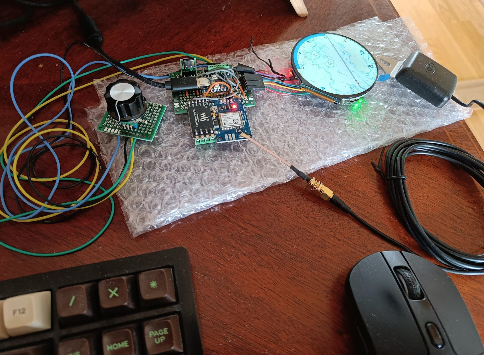
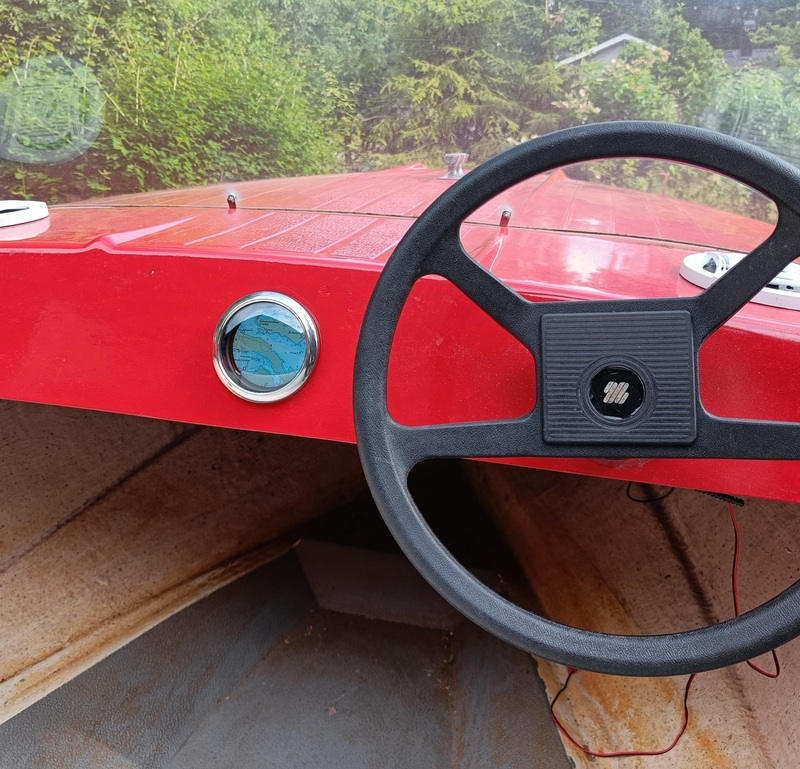

# Maelir
Maelir is a round screen GPS plotter for classic boats. It's based on an ESP32S3 and an
ESP32C3, both from waveshare, plus a UBLOX Neo-7M GPS module and a rotary encoder.




-----
The rest of the document is just for me to remember commands, for now. TODO: More description...

Qt:

```
cmake -B maelir -GNinja -DCMAKE_BUILD_TYPE=Debug ~/projects/maelir/qt/
```

Unittest:

```
cmake -B maelir_unittest -GNinja -DCMAKE_BUILD_TYPE=Debug ~/projects/maelir/test/unittest
```


Target:

```
source $HOME/.espressif/tools/activate_idf_v6.0.2.sh
pip3 install Pillow

cd <src>/target/qualia_esp32s3
idf.py update-dependencies

cmake -GNinja -B maelir_qualia_esp32s3/ -DCMAKE_BUILD_TYPE=Release ~/projects/maelir/target/qualia_esp32s3
```

Create the map data:
```
ulimit -n 65536
tools/image_save.py image_cache out_dir <path-to-saved-har-json-file>
<qt-build>/map_editor maelir_metadata.yaml
tools/tiler.py maelir_metadata.yaml map.bin
```

Flash the map:
```
esptool.py write_flash --flash_mode dio --no-compress --flash_freq 40m --flash_size 16MB 0x00400000 map_data.bin
```

Flash the op board:
```
python -m esptool write_flash @flash_project_args && python -m esp_idf_monitor -p /dev/tty.wchusbserial59710824481 ./maelir_waveshare_io_board_esp32h2.elf
```
